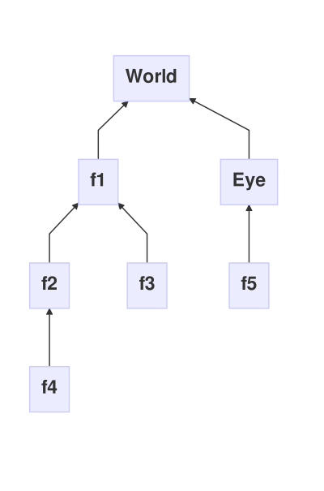

# Frames

## Introduction

This is some text[^1].

frame_hierarchy.mermaid (only by means of keeping a reference to ```referenceFrame()```)
Link me to: active vs passive transformations & stack of transformations

A Frame is a 2D or 3D coordinate system, represented by a _position()_, an _orientation()_ and _magnitude()_. The order of these transformations is important: the Frame is first translated, then rotated around the new translated origin and then scaled.

A Frame is useful to define the position, orientation and magnitude of an object, using its ```matrix``` method, as shown below:

```java
    Frame frame = new Frame();
    frame.setPosition(new Vec(0.5,0,0));
    frame.setOrientation(new Quat(new Vec(0,1,0), new Vec(1,1,1)));
    scene.pushModelView();
    scene.applyModelView(frame.matrix());
    // Draw your object here, in the local frame coordinate system.
    scene.popModelView();
```

## Point transformations

Many functions are provided to transform a point from one coordinate system (Frame) to an other: see ```coordinatesOf(Vec)```, ```inverseCoordinatesOf(Vec)```, ```coordinatesOfIn(Vec, Frame)```, ```coordinatesOfFrom(Vec, Frame)```...
 
## Vector transformations

You may also want to transform a vector (such as a normal), which corresponds to applying only the rotational part of the frame transformation: see ```transformOf(Vec)``` and ```inverseTransformOf(Vec)```.

The ```translation()```, ```rotation()``` and uniform positive ```scaling()``` that are encapsulated in a Frame can also be used to represent an angle preserving transformation of space. Such a transformation can also be interpreted as a change of coordinate system, and the coordinate system conversion functions actually allow you to use a Frame as an angle preserving transformation. Use ```inverseCoordinatesOf(Vec)``` (resp. ```coordinatesOf(Vec)```) to apply the transformation (resp. its inverse). Note the inversion.

## Hierarchy of Frames

The position, orientation and magnitude of a Frame are actually defined with respect to a ```referenceFrame()```. The default ```referenceFrame()``` is the world coordinate system (represented by a {@code null} ```referenceFrame()```). If you ```setReferenceFrame(Frame)``` to a different Frame, you must then differentiate:

1. The *local* ```translation()```, ```rotation()``` and ```scaling()``` , defined with respect to the ```referenceFrame()```.
2. The *global* ```position()```, ```orientation()``` and ```magnitude()```, always defined with respect to the world coordinate system.

A Frame is actually defined by its ```translation()``` with respect to its ```referenceFrame()```, then by ```rotation()``` of the coordinate system around
the new translated origin and then by a uniform positive ```scaling()``` along its rotated axes.

This terminology for *local* (```translation()```, ```rotation()``` and ```scaling()```) and <b>global</b> ( ```position()```, ```orientation()``` and
```magnitude()```) definitions is used in all the methods' names and should be sufficient to prevent ambiguities. These notions are obviously identical when the ```referenceFrame()``` is ```null```, i.e., when the Frame is defined in the world coordinate system.

Frames can hence easily be organized in a tree hierarchy, which root is the world coordinate system. A loop in the hierarchy would result in an inconsistent (multiple) Frame definition. Therefore ```settingAsReferenceFrameWillCreateALoop(Frame)``` checks this and prevents ```referenceFrame()``` from creating such a loop.

This frame hierarchy is used in methods like ```coordinatesOfIn(Vec, Frame)```, ```coordinatesOfFrom(Vec, Frame)``` ... which allow coordinates (or vector)
conversions from a Frame to any other one (including the world coordinate system).



## Constraints

An interesting feature of Frames is that their displacements can be constrained. When a ```Constraint``` is attached to a Frame, it filters the input of ```translate(Vec)``` and ```rotate(Rotation)```, and only the resulting filtered motion is applied to the Frame. The default ```constraint()``` ```null```
resulting in no filtering. Use ```setConstraint(Constraint)``` to attach a Constraint to a frame.

Classical constraints are provided for convenience: 

1. ```LocalConstraint```
2. ```WorldConstraint```
3. EyeConstrain```

and new constraints can very easily be implemented.

## Derived classes

The ```GenericFrame``` class inherits Frame and implements
all sorts of motion actions, so that a Frame (and hence an object) can be manipulated
in the scene by whatever user interaction means you can imagine.


[^1]: Some *crazy* footnote definition.
