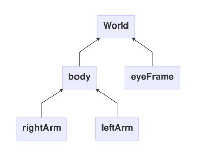

# Frames

## Introduction

Geometry transformations allow to control de view-point and interact with the objects within a virtual environment. A given geometry transformation of a point defined within a coordinate system can be understood in two different, but equivalent ways: either the physical position of the point is transformed while the coordinate system remains fixed, or the coordinate system changes (also referred to as _change of basis_[^1]) while the point remains fixed. The former interpretation sometimes is referred to as _active_ or _alibi_ transformation while the second is referred to as _passive_ or _alias_ transformation[^2].

Active transformations are more suitable to handle rigid body transformations (i.e., a body where the distances between every pair of points remains always the same). Passive transformations allow to represent the relative motion of an articulated body where each of its elements lies in its own _local_ coordinate system. In the latter case, the coordinate systems may form a rooted tree-hierarchy that can easily be traversed by means of a matrix stack of transformations[^3]:

```java
void traverse(CoordinateSystem sys) {
  pushMatrix();
  applyMatrix(sys.matrix());
  sys.visitCallback();
  for (CoordinateSystem child : sys.children())
    traverse(child);
  popMatrix();
}
```

and then just calling ```traverse(root)``` on the root coordinate system. Note in the pseudo-code above that the ```CoordinateSystem``` can be represented by a single transformation matrix ($$M$$).

## Interactive Frames

In Proscene an _InteractiveFrame_ (or simply a _frame_) is a 2D or 3D coordinate system encapsulating a _passive_ _angle preserving_ transformation ($$M$$) compose of a ```translation``` ($$T$$), a ```rotation``` ($$R$$) and a uniform, positive ```scaling``` ($$S$$). These individual transformations are defined respect to a _reference frame_ which is just another frame instance that may be ```null```, when it stands for the world coordinate system.

Since geoemtry transformations don't generally commute, the order of these transformations is important: the frame is first translated, then rotated around the new translated origin and then scaled, i.e., $$M=TRS$$. Mnemonically, this transformation composition may be read from right-to-left too as: the interactive-frame is first scaled, then rotated around the reference frame origin and then translated respect to the reference frame origin.

To define a frame simply pass the ```scene``` object to its constructor:

```java
import remixlab.proscene.*;
import remixlab.dandelion.geom.*;

Scene scene;
InteractiveFrame frame;
void setup() {
  ...
  scene = new Scene(this);
  InteractiveFrame frame = new InteractiveFrame(scene);
  frame.setTranslation(new Vec(0.5,0,0));
  frame.setRotation(new Quat(new Vec(0,1,0), new Vec(1,1,1)));
  frame.setScaling(2);
}
```

To set the frame transformation matrix above the following methods were used:

1. ```setTranslation(Vec)``` which expects a ```remixlab.dandelion.geom.Vec``` instance representing a 2D or 3D vector;
2. ```setRotation(Rotation)``` expecting a ```remixlab.dandelion.geom.Rotation``` instance which in 2D is a ```Rot``` and in 3D is a ```Quat``` (as in the above example); and,
3. ```setScaling(float)``` which simply expects a positive ```float``` value.

Since the composition sequence is fixed within the frame, the order in which these methods are called doesn't count. The frame constructor ```new InteractiveFrame(scene)``` sets the frame matrix transformation to its default identity value, i.e., no translation, no rotation and unit scaling, when they aren't present.

The frame ```matrix()``` method will then be useful to render an object onto the screen, as follows:

```java
void draw() {
  pushMatrix();
  scene.applyModelView(frame.matrix());
  drawObject();
  popMatrix();
}
```

## Hierarchy of Frames

By simply calling ```setReferenceFrame(Frame)```, frames can easily be organized in a rooted tree hierarchy which root is the world coordinate system. This method prevents the creation of loops in the hierarchy and print a warning about it whenever it's going to happen. Frames can be re-rooted at any time by calling this method on different frame instances which may even be null (see next paragraph).

The default ```referenceFrame()``` is the world coordinate system (represented by a ```null``` ```referenceFrame()```). If ```setReferenceFrame(Frame)``` is called on a different frame, then the following must be discern:

1. The *local* ```translation()```, ```rotation()``` and ```scaling()``` , defined with respect to the ```referenceFrame()```; and,
2. The *global* ```position()```, ```orientation()``` and ```magnitude()```, always defined with respect to the world coordinate system. The ```setPosition(Vec)```, ```setOrientation(Rotation)``` and ```setMagnitude(float)``` methods sets the global paramenters.

This terminology for *local* (```translation()```, ```rotation()``` and ```scaling()```) and *global* ( ```position()```, ```orientation()``` and
```magnitude()```) definitions is used among all the frame class API and should be sufficient to prevent ambiguities. These notions are obviously identical when the ```referenceFrame()``` is ```null```, i.e., when the frame is defined in the world coordinate system.

As an illustration, take the following code:

```java
Scene scene;
InteractiveFrame body, leftArm, rightArm;
void setup() {
  ...
  scene = new Scene(this);
  InteractiveFrame body = new InteractiveFrame(scene);
  InteractiveFrame leftArm = new InteractiveFrame(scene);
  InteractiveFrame rightArm = new InteractiveFrame(scene);
  leftArm.setReferenceFrame(body);
  rightArm.setReferenceFrame(body);
}
```

which defines this tree hierarchy:



The ```eyeFrame``` is used set up a viewpoint to render the scene from and will be discussed separately in the [Eye](eye.md) chapter. Now the tree hierarchy may be rendered onto the screen, as follows:

```java
void draw() {
  pushMatrix();  
  scene.applyModelView(body.matrix());
  drawBody();
  pushMatrix();
  scene.applyTransformation(leftArm);// same as scene.applyModelView(leftArm.matrix());;
  drawArm();
  popMatrix();
  pushMatrix();
  rightArm.applyTransformation();// same as scene.applyTransformation(leftArm);
  drawArm();
  popMatrix();
  popMatrix();
}
```

While a ```pushMatrix``` followed by one of the (equivalent) apply transformation methods (```Scene.applyModelView(Mat)```, ```Scene.applyTransformation(InteractiveFrame)``` or simply ```InteractiveFrame.applyTransformation()```) calls mean _entering_ into the frame coordinate system, a ```popMatrix``` means _leaving_ it and returning to its reference frame.

## Transformations among frames

There are several situations where it's useful to transform a given point or vector among frame instances. Consider, for example, the case where an object defined in its own local frame, such as a car, should be translated respect to another frame such as such the world coordinate system. The [Frame API](http://remixlab.github.io/proscene-javadocs) provides several methods to transform its ```rotation```, such as [rotate(Rotation)](http://remixlab.github.io/proscene-javadocs/remixlab/dandelion/geom/Frame.html#rotate-remixlab.dandelion.geom.Rotation-). Since the Rotation parameter in that method should be given in the frame coordinate system, the desired effect can be achived with a two-step process:

1. Transform the parameter into the frame coordinate system where the method expect it; and,
2. Call the method performing the transformation on the transformed parameter.

From Frame transformations

| From    | world                    | referenceFrame                | otherFrame                          |
|---------|--------------------------|-------------------------------|-------------------------------------|
|  Points | ```coordinatesOf(Vec)``` | ```localCoordinatesOf(Vec)``` | ```coordinatesOfFrom(Vec, Frame)``` |
| Vectors | ```transformOf(Vec)```   | ```localTransformOf(Vec)```   | ```transformOfFrom(Vec, Frame)```   |

To Frame transformations

| To      | world                           | referenceFrame                       | otherFrame                        |
|---------|---------------------------------|--------------------------------------|-----------------------------------|
|  Points | ```inverseCoordinatesOf(Vec)``` | ```localInverseCoordinatesOf(Vec)``` | ```coordinatesOfIn(Vec, Frame)``` |
| Vectors | ```inverseTransformOf(Vec)```   | ```localInverseTransformOf(Vec)```   | ```transformOfIn(Vec, Frame)```   |

## Point transformations

Many functions are provided to transform a point from one frame to an other: see ```coordinatesOf(Vec)```, ```inverseCoordinatesOf(Vec)```, ```coordinatesOfIn(Vec, Frame)```, ```coordinatesOfFrom(Vec, Frame)```...
 
## Vector transformations

You may also want to transform a vector (such as a normal), which corresponds to applying only the rotational part of the frame transformation: see ```transformOf(Vec)``` and ```inverseTransformOf(Vec)```.

## Constraints

An interesting feature of Frames is that their displacements can be constrained. When a ```Constraint``` is attached to a Frame, it filters the input of ```translate(Vec)``` and ```rotate(Rotation)```, and only the resulting filtered motion is applied to the Frame. The default ```constraint()``` ```null```
resulting in no filtering. Use ```setConstraint(Constraint)``` to attach a Constraint to a frame.

Classical constraints are provided for convenience: 

1. ```LocalConstraint```
2. ```WorldConstraint```
3. ```EyeConstraint```

and new constraints can very easily be implemented.

## Derived classes

The ```GenericFrame``` class inherits Frame and implements
all sorts of motion actions, so that a Frame (and hence an object) can be manipulated
in the scene by whatever user interaction means you can imagine.

[^1]: [Change of Basis](https://en.wikipedia.org/wiki/Change_of_basis)
[^2]: [3D Math Primer for Graphics and Game Development](http://gamemath.com/)
[^3]: [Transformations Processing Tutorial](https://www.processing.org/tutorials/transform2d/)
